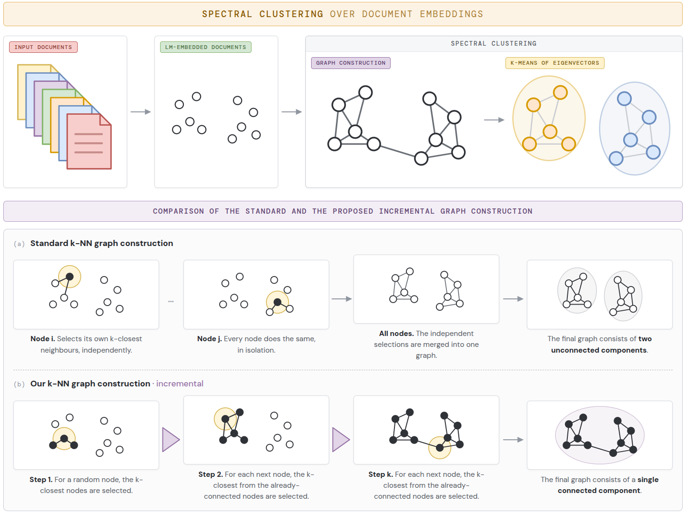

# Incremental Graph Construction Enables Robust Spectral Clustering of Texts

Code accompanying the paper *"Incremental Graph Construction Enables Robust Spectral Clustering of Texts"* (Pranjić, Koloski, Lavrač, Pollak, Robnik-Šikonja). The incremental k-NN construction inserts nodes one at a time and links each new node to its k nearest already-inserted nodes, which guarantees a connected neighborhood graph for every k.



## Layout

```
src/main.py            single argparse driver exposing every experimental axis
src/graph_stats.py     graph descriptive statistics (transitivity, homophily, ...)
src/ordering.py        node-insertion orderings: random / centroid / class / temporal
scripts/make_tables.py regenerates every data-derived table body in the paper
scripts/make_figures.py regenerates the per-dataset result figures (Figures 2-3)
scripts/cost_benchmark.py fair construction-cost benchmark (Table 8)
scripts/*.sbatch       the exact SLURM scripts used for every experiment
scripts/smoke_test.sh  ~2-minute end-to-end verification on a CPU box
container/             Apptainer/Singularity recipe pinning the environment
data/inter_data.csv    per-(model, dataset, k) V-measures behind Figures 2-3
```

## Installation

Either build the container (recommended; pins all versions):

```bash
cd container && ./build.sh          # produces clustgraphs.sif
```

or install directly:

```bash
pip install -r container/requirements.txt
```

## Quick verification

```bash
scripts/smoke_test.sh               # one task, one k, one seed, MST on+off; ~2 min on CPU
```

## Reproducing the paper

All datasets are the public MTEB clustering tasks and are downloaded automatically on first use. Each experiment writes JSONL records; the table generators aggregate them into the exact LaTeX table bodies used in the manuscript.

| Paper artifact | Experiment (SLURM) | Aggregation |
|---|---|---|
| Table 7 (k-NN / k-NN+MST / Ours / Ours+MST) | `scripts/r23_nnmst_l12_corrected_arnes.sbatch`, `scripts/r23_ours_md_l12_arnes.sbatch`, `scripts/r23_mdmst_l12_corrected_arnes.sbatch` | `python scripts/make_tables.py r23` |
| Table 8 (computational cost) | `scripts/r25_cost_arnes.sbatch` | `python scripts/make_tables.py r25` |
| Table 9 (ordering sensitivity + homophily) | `scripts/r23_orderings_l12_arnes.sbatch` | `python scripts/make_tables.py r12b` |
| Table 10, B1, B2 (graph statistics across orderings) | `scripts/r12a_graphstats_l12_arnes.sbatch` | `python scripts/make_tables.py r12a` |
| Table C1 (Bayesian ROPE analysis) | (uses the Table 7 runs) | `python scripts/make_tables.py bayes` |
| Figures 2-3 | (uses `data/inter_data.csv` + published Table 4 values) | `python scripts/make_figures.py` |

The generators expect the JSONL outputs under `results_arnes/<run-name>/` relative to the repository root; adjust the `RES` constant in `scripts/make_tables.py` if you keep them elsewhere.

## Hardware note

The cost benchmark (Table 8) was run on a CPU node of the Vega EuroHPC system (2× 64-core AMD EPYC 7H12, 256 GB RAM), single process, four BLAS/OpenMP threads; library versions are pinned in the container image.

## License

Apache-2.0 (see `LICENSE`).

## Citation

```bibtex
@article{pranjic2026incremental,
  title   = {Incremental Graph Construction Enables Robust Spectral Clustering of Texts},
  author  = {Pranji\'c, Marko and Koloski, Boshko and Lavra\v{c}, Nada and Pollak, Senja and Robnik-\v{S}ikonja, Marko},
  journal = {Machine Learning (under review)},
  year    = {2026}
}
```
